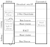

SavetyLoopHost
---------------

To maintain the robots integrity even if the developed software contains bugs a savety loop was introduced. It on the hardware side it consists of a ESP32 D1-mini dev board that consits of a microcontroller with a WLAN interface. It can be programmed in the arduino framework, that makes the development very easy. The robot is disabled by intercepting the enable line of the motor drivers. A client device controlling the system can be introduced by any other process that has access to the network. The overall design is depicted in the following figure. The comunication is done using **UDP** to be robust against network issues. 

The software on the ESP32 represents a state machine that has three states *init*, *run* and *halt*. 

A user process can either send a *reset* signal that must contain a **R** in the first digits in its ascii encoded data packet and a *halt* signal that must contain a **H** instead. Any other signal is interpreted as a *run beacon*. Packages must be sent to port number 8888. The host device will return its status information by sharing a string containing to each registered client. The status will be sent to each client that has sent a *run beacon* or a *halt* signal once. In case the host receives a *reset* signal it forgets all host information and switches to the *init* state again. The motor drivers are enabled in the running state only. The host can handle up to 5 clients that must all consent to operation via thier *run beacon*. If a host stays away more than 5 seconds the host changes to *halt*. In this thesis a android app is developed as a remote control. The code is given in a git.